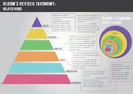

# Engage with the content 

## Read critically W2, 3, & 9

### Summary and Reaction 

The Summary and Reaction pieces are designed to help you learn how to think critically about what you read. There are three opportunities to write a "S&R" throughout the term. Each one is an opportunity to engage with research that is relevant to your assessment and/or the lecture content and to think hard about how it relates to what you already know or are learning about research in psychology. 

*Summary* 

Use the library website to find the paper and read it carefully. Practice your paraphrasing (i.e. writing in your own words), by putting the paper away out of sight, and writing a summary of what purpose of the research was, what they did and what they found (~100 words).  

*Reaction* 

Then choose 2 of the following statements to guide your reaction to the paper. For each statement, write 3-4 sentences (~100-150 words) explaining your point. 

-       I was surprised that… 
-       I can see that this paper relates to… 
-       The paper reminded me of…
-       I was confused by… 
-       It seems that the next step in this area of research would be to…
-       The authors seem to have missed… 
-       The most interesting part of this paper was… 
-       When I was reading I was excited to learn that… 
-       I’m not sure that I understood why… 
-       I wonder whether… 
-       Future work in this area needs to consider… 
-       I wasn’t convinced that… 
-       The evidence for the claim that… seemed… 
-       The logic of the rationale was [compelling, flawed, confusing, unclear] because… 

> This summary & reaction activity activity was created by A/Prof Jenny Richmond, j.richmond@unsw.edu.au

 

### Week 2 SR media 

You should write this summary and reaction about the paper you have been assigned for your *media assignment*. It is a good opportunity to make an early start on the assignment!

### Week 3 SR developmental

You should write this summary and reaction about the paper listed below. This is a recently published paper in developmental psychology that is related to lecture content. 

Zhao, L., Chen, L., Sun, W., Compton, B. J., Lee, K., & Heyman, G. D. (2019). Young children are more likely to cheat after overhearing that a classmate is smart.*Developmental Science*, e12930. 

### Week 9 SR social

You should write this summary and reaction about the paper listed below. This is a recently published paper in social psychology that is related to lecture content. 

Fan, Y., Shepherd, L. J., Slavich, E., Waters, D., Stone, M., Abel, R., & Johnston, E. L. (2019). Gender and cultural bias in student evaluations: Why representation matters.*PloS one,14(2),* e0209749. 

## Evidence-based revision W5 & 10

Research suggests that retrieval practice (i.e., the testing effect) is an effective strategy to enhance learning and long-term memory. But in using testing as a study strategy, it is tempting to write questions that just require you to remember facts from the lectures. 

Watch [this video](https://www.youtube.com/watch?time_continue=7&v=_wqG7g1kZUo) about the testing effect. 

To get the most benefit out of testing, it is important to tap into higher levels of Blooms Taxonomy than just remembering and understanding. 

 
```{r echo=FALSE}

```


This [Good Practice guide](https://moodle.telt.unsw.edu.au/pluginfile.php/5462158/mod_book/chapter/247306/031112-goodpracticeguide-hw.pdf?time=1584271499539)  is designed for teachers and it contains some good tips about how to write MCQ that tap into the higher levels of Bloom’s taxonomy. Have a read (particularly pg 8-17) to learn about how to construct MCQ that require you to apply, analyse and perhaps even evaluate or material related to the course.

Then… put this study strategy into practice! 


### Week 5 Retrieval practice I

We have made it through the developmental section of the course and now is a good time to start thinking about study strategies. 
 
Review the developmental psychology lecture content covered so far and create 3 multiple choice questions to test your knowledge. The harder the better!! 

Upload these questions to the developmental psychology ‘Student quiz’ link. Make sure you include a description of why you think the correct answer is the correct answer in the feedback box. 

To get your credit for completing this task, also upload a copy of your 3 questions in the activity tool.

> This retrieval practice activity worksheet was created by A/Prof Jenny Richmond, j.richmond@unsw.edu.au

### Week 10 Retrieval practice II

We have made it through the social section of the course and exams are coming up. Now is a really good time to start thinking about study strategies. 
 
Review the developmental psychology lecture content covered so far and create 3 multiple choice questions to test your knowledge. The harder the better!! 

Upload these questions to the social psychology ‘Student quiz’ link. Make sure you include a description of why you think the correct answer is the correct answer in the feedback box. 

To get your credit for completing this task, also upload a copy of your 3 questions in the activity tool.  

> This retrieval practice activity worksheet was created by A/Prof Jenny Richmond, j.richmond@unsw.edu.au

## Apply your knowledge W7, 9, & 10

### Week 7 & 9 Online stats 

These activity is an opportunity to apply what you are learning about research methods and statistics in RM2 to problem in developmental (week 7) and social psychology (Week 9). You might say, hang on, this is a social and developmental psychology class- why are they having me do statistics? 

In my experience students who take psychology are typically a little bit anxious about maths. In research methods courses, we mostly teach you how to do the tests, and how to interpret them but in a way that is almost void of an interesting research question.  

These lessons are designed to give you just a taste of how statistics works in the context of developmental psychology and social psychology research, in a situation where it is really low stakes. It’s a chance to see how what you are learning in one course can be applied to questions in another.  If you decide to try it out, complete the h5p lesson and answer the question in the activity tool.  


### Week 10 Real world

16: the real world 

We have made it to the end of the term and it might helpful to look back on how you are different now than you were 10 weeks ago. In your own way, describe how PSYC2061: Social and Developmental Psychology has changed the way you experience, understand, or ask questions about the real world.  

Perhaps the course has changed the way you learn, the way you interact with others, how you interpret sitations, your sense of self as a human being, a student, a scientist, or a psychologist? 

There are no right or wrong answers in this activity, and all genuine attempts will be marked.  

Your answer can be in any format – a written reflection with an attached drawing, painting, calligraphy, photo, cartoon/comic, meme, video, comedic sketch, quote/haiku/koan/poem/sonnet, a riddle, a puzzle, a letter, a postcard, a Instagram post, a Tweet, craft, origami, sculpture, public art, street art, food art etc.  

Be creative! Upload your response to the link in Moodle. 


> This real world application activity was adapted from a resource by Dr May Lim, m.lim@unsw.edu.au.  
